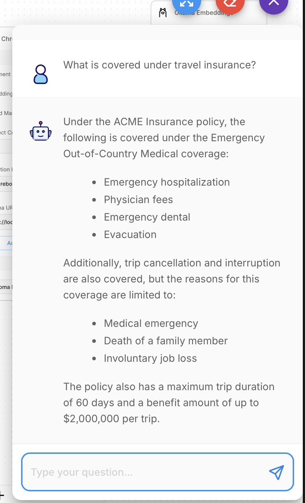

# InsureBot 🤖

> An AI-powered insurance assistant that answers policy questions,
> guides users through claims, and provides instant quotes.
> Built with LangChain, Llama 3, ChromaDB, FastAPI, and Terraform.

## Architecture

[Architecture diagram will go here]

## Demo



## Tech Stack

- **LLM**: Llama 3 via Groq API (or Ollama locally)
- **RAG Pipeline**: LangChain + ChromaDB
- **Backend**: FastAPI (Python)
- **Database**: PostgreSQL (Supabase)
- **Chat UI**: Flowise
- **IaC**: Terraform
- **CI/CD**: GitHub Actions

## Quick Start
```bash
git clone https://github.com/alexshr5/InsureBot
cd insurebot
cp .env.example .env
pip install -r backend/requirements.txt
uvicorn backend.app.main:app --reload
```
